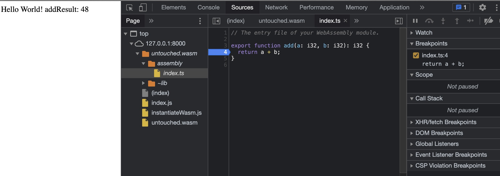

# assemblyscript-demo

1. add assembly logic in *assembly/index.ts*

2. run script to build wasm
``` npm
npm run asbuild:untouched
```

3. serve static files
``` python
python ./wasmServer.py
```

4. you can debug in browser now
